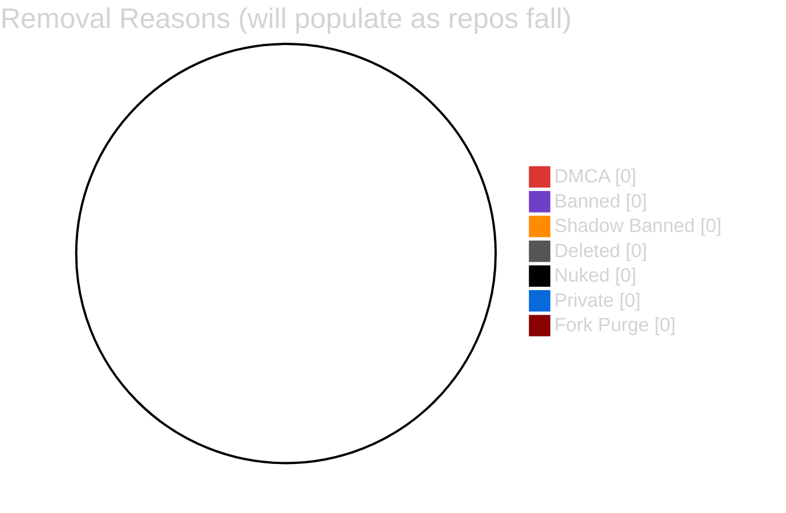

<div align="center">

[](https://git.io/typing-svg)

<br>

     

*Last updated: 2026-04-01*

</div>

---

## `> cat /etc/motd`

```
+------------------------------------------------------------------------------+
|                                                                              |
|   Repos disappear from GitHub every day -- DMCA takedowns, account bans,     |
|   shadow bans, suspensions, or authors deleting their work. Some of these    |
|   projects were valuable tools, research, educational resources, or pieces   |
|   of internet history that deserve to survive.                               |
|                                                                              |
|   This repository preserves full source snapshots of fallen projects so      |
|   they remain accessible to the community.                                   |
|                                                                              |
|   "The internet never forgets -- but sometimes it needs help remembering."   |
|                                                                              |
+------------------------------------------------------------------------------+
```

---

## `> ls -la archive/`

<div align="center">

### Archived Repositories

| # | Repository | Original Author | Reason | Category | Stars | Date Archived |
|:-:|:-----------|:----------------|:------:|:--------:|:-----:|:-------------:|
| -- | *Archive empty* | -- | -- | -- | -- | -- |

*Monitoring 83 starred repos, 71 forks, and 17 subscriptions. When they fall, they land here.*

</div>

---

## `> cat removal_codes.conf`

<div align="center">

| | Tag | Meaning | Badge |
|:-:|:---:|:--------|:-----:|
| X | `DMCA` | Removed via DMCA takedown notice |  |
| X | `BANNED` | Author account banned or suspended |  |
| X | `SHADOW` | Shadow-banned -- accessible but hidden from search/discovery |  |
| X | `DELETED` | Voluntarily deleted by author or org |  |
| X | `NUKED` | Entire account nuked, all repos gone |  |
| X | `PRIVATE` | Made private after being public -- lost to community |  |
| X | `FORK-PURGE` | Upstream deleted, all forks cascade-removed |  |

</div>

---

## `> cat stats.json`

<div align="center">



</div>

---

## `> tree repos/`

```
fallen-repos/
  README.md                    <-- this index
  _ARCHIVE_TEMPLATE.md         <-- copy into each archived repo
  repos/
    project-name/              <-- full source snapshot
      _ARCHIVE.md              <-- metadata record
      ...                      <-- original repo contents
```

<details>
<summary><strong>> cat _ARCHIVE_TEMPLATE.md</strong></summary>

```markdown
# Archive Record

- **Original URL:** https://github.com/author/repo
- **Author:** @author
- **Reason Lost:** DMCA / BANNED / SHADOW / DELETED / NUKED / PRIVATE / FORK-PURGE
- **Date Lost:** YYYY-MM-DD
- **Date Archived:** YYYY-MM-DD
- **Stars (last known):** N
- **Language(s):**
- **License:**
- **Description:** What this project was and why it mattered
- **Context:** Why/how it was removed (if known)
- **Source:** Where the snapshot was obtained (local clone, archive.org, etc.)
```

</details>

---

## `> cat CONTRIBUTING.md`

If you have a local clone of a repo that has since been removed from GitHub:

```bash
# 1. Fork this repo
gh repo fork Ringmast4r/fallen-repos

# 2. Add the project
cp -r /path/to/dead-repo repos/project-name/

# 3. Copy the archive template
cp _ARCHIVE_TEMPLATE.md repos/project-name/_ARCHIVE.md

# 4. Fill in the metadata, commit, and open a PR
```

PRs should include:
- The full source snapshot under `repos/`
- A filled-out `_ARCHIVE.md` with as much metadata as possible
- Context in the PR description on why the project was notable

---

## `> cat DISCLAIMER`

```
This archive exists for EDUCATIONAL and PRESERVATION purposes only.

- Archived code retains its original license
- No ownership is claimed over any archived content
- Original authors may request removal via GitHub Issues
- Removal requests will be honored promptly

This project does not encourage or facilitate piracy, infringement,
or unauthorized distribution of proprietary software.
```

---

<div align="center">

```
+------------------------------------------------------------------------------+
|                                                                              |
|   "They can delete the repo, but they can't delete the clone."              |
|                                                                              |
|                                               - THE GRAVEYARD               |
|                                                                              |
+------------------------------------------------------------------------------+
```


</div>


