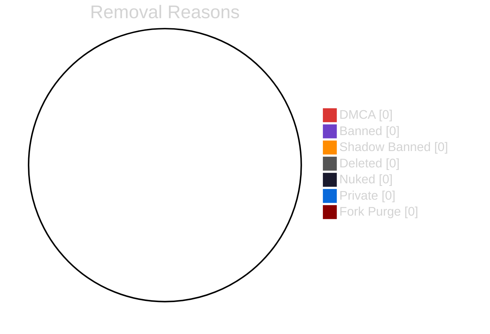
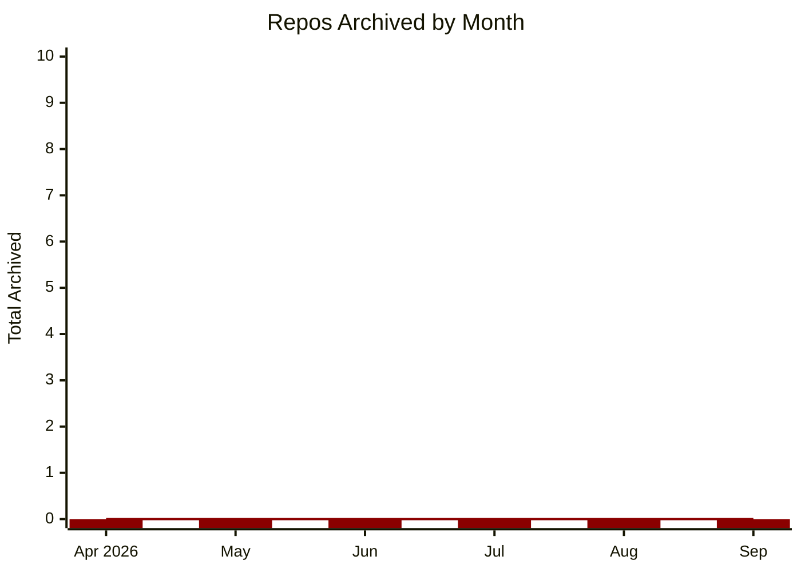
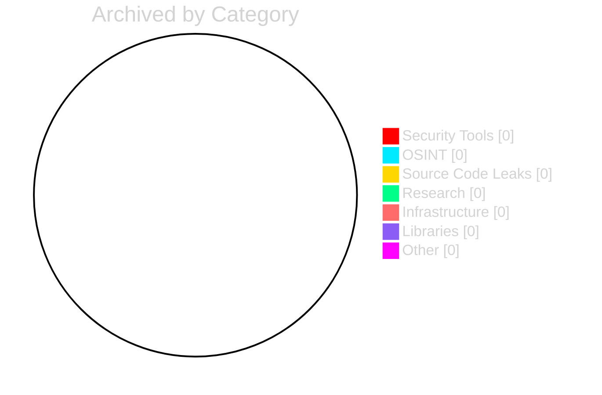
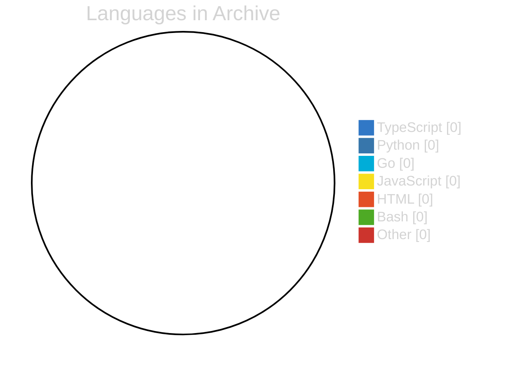
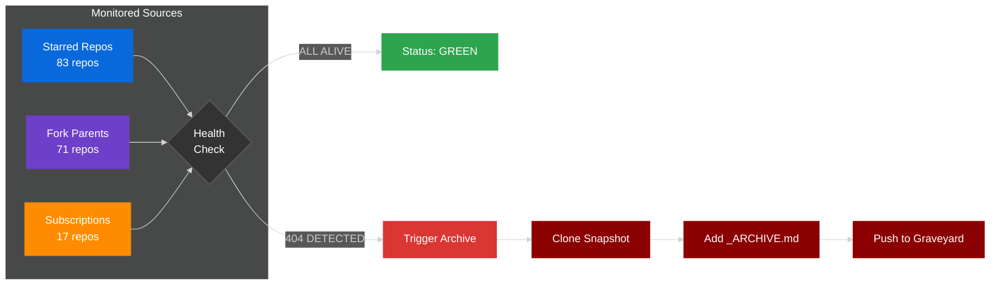
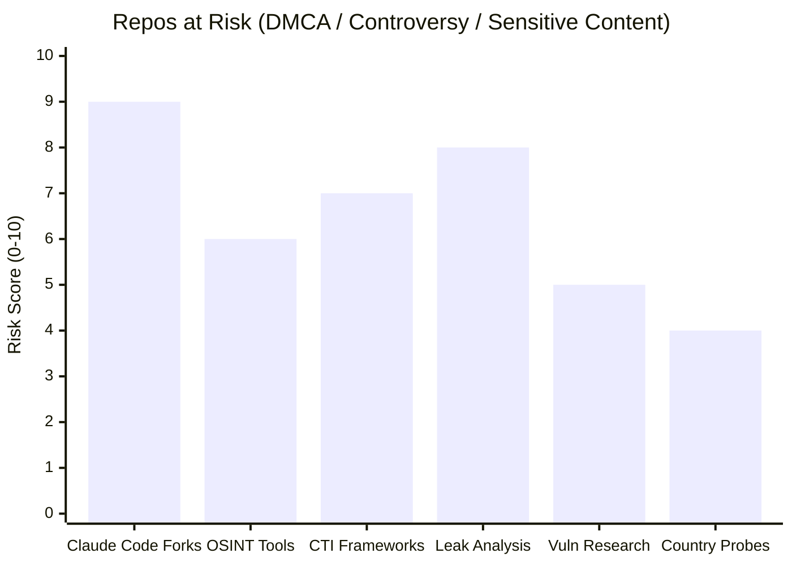
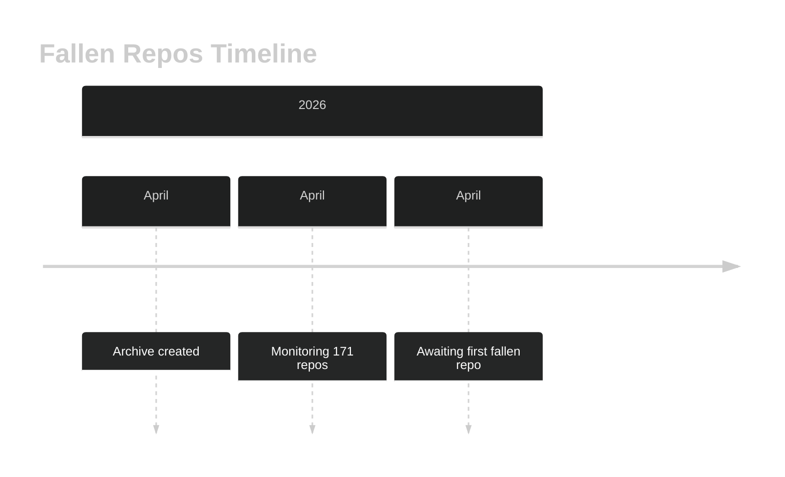
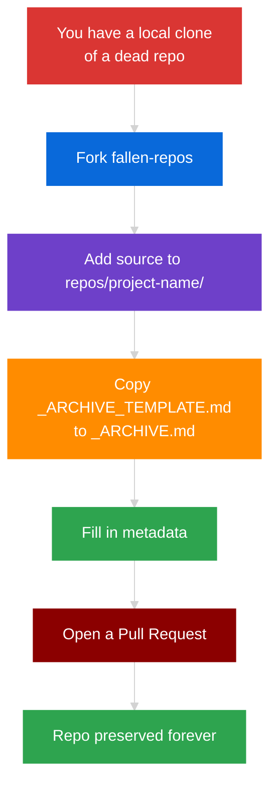

<div align="center">

[](https://git.io/typing-svg)

<br>

|  |  |  |  |  |  |  |
|---|---|---|---|---|---|---|

<br>

|  |  |  |  |  |
|---|---|---|---|---|

*Last scan: 2026-04-01 -- Next scan: on demand*

</div>

---

## `> cat /etc/motd`

```
+------------------------------------------------------------------------------+
|                                                                              |
|   Repos disappear from GitHub every day -- DMCA takedowns, account bans,     |
|   shadow bans, suspensions, or authors deleting their work. Some of these    |
|   projects were valuable tools, research, educational resources, or pieces   |
|   of internet history that deserve to survive.                               |
|                                                                              |
|   This repository preserves full source snapshots of fallen projects so      |
|   they remain accessible to the community.                                   |
|                                                                              |
|   "The internet never forgets -- but sometimes it needs help remembering."   |
|                                                                              |
+------------------------------------------------------------------------------+
```

---

## `> dashboard --live`

<div align="center">

### Graveyard Statistics



### Archive Growth Over Time



### Category Breakdown



### Languages Preserved



</div>

---

## `> monitoring --status`

<div align="center">

### Watched Sources Health Check



### Threat Level



</div>

---

## `> ls -la archive/`

<div align="center">

### Archived Repositories

| # | Repository | Original Author | Reason | Category | Language | Stars | Date Lost | Date Archived |
|:-:|:-----------|:----------------|:------:|:--------:|:--------:|:-----:|:---------:|:-------------:|
| -- | *The graveyard is empty* | -- | -- | -- | -- | -- | -- | -- |

*When they fall, they land here.*

</div>

---

## `> cat removal_codes.conf`

<div align="center">

| | Code | Meaning | Color | Badge |
|:-:|:----:|:--------|:-----:|:-----:|
| 1 | `DMCA` | Removed via DMCA takedown notice |  |  |
| 2 | `BANNED` | Author account banned or suspended |  |  |
| 3 | `SHADOW` | Shadow-banned -- hidden from search/discovery |  |  |
| 4 | `DELETED` | Voluntarily deleted by author or org |  |  |
| 5 | `NUKED` | Entire account nuked, all repos gone |  |  |
| 6 | `PRIVATE` | Made private -- lost to community |  |  |
| 7 | `FORK-PURGE` | Upstream deleted, forks cascade-removed |  |  |

</div>

---

## `> timeline --archive`

<div align="center">

### Archive Timeline



### Event Log

```mermaid
%%{init: {'theme': 'dark'}}%%
gitgraph
    commit id: "2026-04-01" tag: "v1.0"
    commit id: "Archive Created"
    commit id: "Monitoring Active"
    commit id: "Awaiting First Fall..."
```

</div>

---

## `> tree repos/`

```
fallen-repos/
  README.md                    <-- this index
  _ARCHIVE_TEMPLATE.md         <-- copy into each archived repo
  repos/
    project-name/              <-- full source snapshot
      _ARCHIVE.md              <-- metadata record (who, what, when, why)
      ...                      <-- original repo contents preserved exactly
```

<details>
<summary><strong>> cat _ARCHIVE_TEMPLATE.md</strong></summary>

```markdown
# Archive Record

- **Original URL:** https://github.com/author/repo
- **Author:** @author
- **Reason Lost:** DMCA / BANNED / SHADOW / DELETED / NUKED / PRIVATE / FORK-PURGE
- **Date Lost:** YYYY-MM-DD
- **Date Archived:** YYYY-MM-DD
- **Stars (last known):** N
- **Forks (last known):** N
- **Language(s):**
- **License:**
- **Description:** What this project was and why it mattered
- **Context:** Why/how it was removed (if known)
- **Source:** Where the snapshot was obtained (local clone, archive.org, etc.)
- **Wayback URL:** https://web.archive.org/web/*/github.com/author/repo
```

</details>

---

## `> cat CONTRIBUTING.md`

<div align="center">



</div>

```bash
# Quick add workflow
gh repo fork Ringmast4r/fallen-repos
cp -r /path/to/dead-repo repos/project-name/
cp _ARCHIVE_TEMPLATE.md repos/project-name/_ARCHIVE.md
# Fill in _ARCHIVE.md, then:
git add -A && git commit -m "Archive: project-name (DMCA)" && git push
gh pr create --title "Archive: project-name" --body "Reason: DMCA'd on YYYY-MM-DD"
```

PRs should include:
- Full source snapshot under `repos/`
- Filled-out `_ARCHIVE.md` with as much metadata as possible
- Context on why the project was notable

---

## `> cat DISCLAIMER`

```
+------------------------------------------------------------------------------+
|                                                                              |
|   This archive exists for EDUCATIONAL and PRESERVATION purposes only.        |
|                                                                              |
|   * Archived code retains its original license                               |
|   * No ownership is claimed over any archived content                        |
|   * Original authors may request removal via GitHub Issues                   |
|   * Removal requests will be honored promptly                                |
|                                                                              |
|   This project does not encourage or facilitate piracy, infringement,        |
|   or unauthorized distribution of proprietary software.                      |
|                                                                              |
+------------------------------------------------------------------------------+
```

---

<div align="center">

### Graveyard Vitals

|  |  |  |  |  |
|---|---|---|---|---|

<br>

```
+------------------------------------------------------------------------------+
|                                                                              |
|   "They can delete the repo, but they can't delete the clone."              |
|                                                                              |
|                                               - THE GRAVEYARD               |
|                                                                              |
+------------------------------------------------------------------------------+
```

<br>


   

</div>


